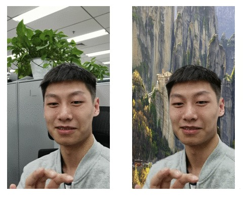

# PP-HumanSeg for Sophgo TPU

powerd by [PP-HumanSeg](https://github.com/PaddlePaddle/PaddleSeg/blob/release/2.6/contrib/PP-HumanSeg/README_cn.md)

Separating human figures and backgrounds at the pixel level is a classic task in image segmentation with a wide range of applications. Generally speaking, this task can be categorized into two types: segmentation targeting half-length portraits, commonly referred to as portrait segmentation; and segmentation targeting both full-body and half-length human figures, commonly known as general human segmentation.

For both portrait and general human segmentation, PaddleSeg has released the PP-HumanSeg series of models, which boast high segmentation accuracy, fast inference speed, and strong versatility. Furthermore, the PP-HumanSeg series models are ready-to-use out of the box, allowing for zero-cost deployment in products, and also support fine-tuning with specific scene data to achieve even better segmentation results.


## setup

```bash
pip install -r requirements.txt

# install sail
https://doc.sophgo.com/sdk-docs/v23.10.01/docs_latest_release/docs/sophon-sail/docs/zh/html/1_build.html
```

## model & data
you can download my model or export by yourself

### download
```bash
# install if need
sudo apt install unzip

chmod -R +x scripts
./scripts/download.sh
```

### export model

```bash
# don't forget to change the model or pic path

# export paddlepaddle -> onnx
pip install paddlepaddle==2.3.0

# download model form https://github.com/PaddlePaddle/PaddleSeg/blob/release/2.6/contrib/PP-HumanSeg/README_cn.md
./export_onnx.sh

# export onnx -> bmodel
# https://doc.sophgo.com/sdk-docs/v23.09.01-lts/docs_latest_release/docs/tpu-mlir/quick_start/html/index.html
./export_bmodel.sh
```

## Input the picture for segmentation

Load the landscape image from data/images/human.jpg, predict using the PP-HumanSeg portrait segmentation model, and save the results in the data/images_result/ directory.

```bash
python src/seg_demo.py \
  --bmodel ./model/pp-humansegv2-mobile_192x192_int8.bmodel \
  --img_path data/images/portrait_heng.jpg \
  --save_dir data/images_result/portrait_heng_v2.jpg \
  --dev_id 5
```

Load the portrait image from data/images/portrait_shu.jpg, predict using the PP-HumanSeg portrait segmentation model.

```bash
python src/seg_demo.py \
  --bmodel ./model/pp-humansegv2-mobile_192x192_int8.bmodel \
  --img_path data/images/portrait_shu.jpg \
  --save_dir data/images_result/portrait_shu_v2.jpg \
  --dev_id 5 \
  --vertical_screen
```

Obtain an image with a replaced background using a background image.

```bash
python src/seg_demo.py \
  --bmodel ./model/pp-humansegv2-mobile_192x192_int8.bmodel \
  --img_path data/images/portrait_heng.jpg \
  --bg_img_path data/images/bg_2.jpg \
  --dev_id 5 \
  --save_dir data/images_result/portrait_heng_v2_withbg.jpg

python src/seg_demo.py \
  --bmodel ./model/pp-humansegv2-mobile_192x192_int8.bmodel \
  --img_path data/images/portrait_shu.jpg \
  --bg_img_path data/images/bg_1.jpg \
  --save_dir data/images_result/portrait_shu_v2_withbg.jpg \
  --vertical_screen \
  --dev_id 5
```


## Input the video for segmentation

Load the landscape video from data/videos/video_heng.mp4, predict using the PP-HumanSeg portrait segmentation model, and save the results in the data/videos_result/ directory.

```bash
# Use PP-HumanSegV2-Lite
python src/seg_demo.py \
  --bmodel ./model/pp-humansegv2-mobile_192x192_int8.bmodel \
  --video_path data/videos/video_heng.mp4 \
  --save_dir data/videos_result/video_heng_v2.avi \
  --dev_id 5

python src/seg_demo.py \
  --bmodel ./model/pp-humansegv2-mobile_192x192_int8.bmodel \
  --video_path data/videos/video_heng.mp4 \
  --use_post_process \
  --save_dir data/videos_result/video_heng_v2_use_post_process.avi \
  --dev_id 5

# Use PP-HumanSegV1-Lite
python src/seg_demo.py \
  --bmodel ./model/pp-humansegv2-mobile_192x192_int8.bmodel \
  --video_path data/videos/video_heng.mp4 \
  --save_dir data/videos_result/video_heng_v1.avi \
  --dev_id 5
```

Load the portrait video from data/videos/video_shu.mp4, predict using the PP-HumanSeg portrait segmentation model.

```bash
python src/seg_demo.py \
  --bmodel ./model/pp-humansegv2-mobile_192x192_int8.bmodel \
  --video_path data/videos/video_shu.mp4 \
  --save_dir data/videos_result/video_shu_v2.avi \
  --vertical_screen \
  --dev_id 5
```

Use a background image to obtain a video with the background replaced.

```bash
python src/seg_demo.py \
  --bmodel ./model/pp-humansegv2-mobile_192x192_int8.bmodel \
  --video_path data/videos/video_heng.mp4 \
  --bg_img_path data/images/bg_2.jpg \
  --use_post_process \
  --save_dir data/videos_result/video_heng_v2_withbg_usepostprocess.avi \
  --dev_id 5
```

Additionally, the DIS (Dense Inverse Search-based method) optical flow post-processing algorithm can be used (requires opencv-python version greater than 4.0) to reduce flickering issues between frames in video prediction.

```bash
python src/seg_demo.py \
  --bmodel ./model/pp-humansegv2-mobile_192x192_int8.bmodel \
  --video_path data/videos/video_shu.mp4 \
  --save_dir data/videos_result/video_shu_v2_use_optic_flow.avi \
  --vertical_screen \
  --use_optic_flow \
  --dev_id 5
  ```

## Perform segmentation with camera input.

Turn on the computer's camera (landscape orientation) for real-time portrait segmentation.

```bash
python src/seg_demo.py \
   --bmodel ./model/pp-humansegv2-mobile_192x192_int8.bmodel
```

Activate the computer camera (landscape mode), add a background image, and conduct real-time portrait segmentation.

```bash
python src/seg_demo.py \
  --bmodel ./model/pp-humansegv2-mobile_192x192_int8.bmodel \
  --bg_img_path data/images/bg_2.jpg
```

The video segmentation results are as follows:


The background replacement results are as follows:

